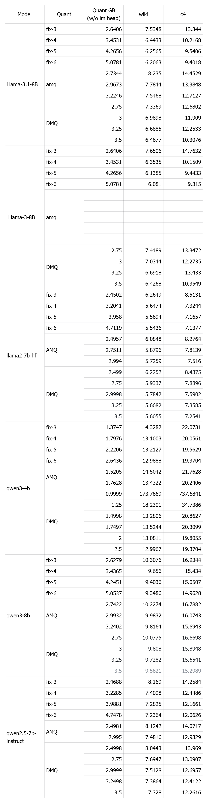
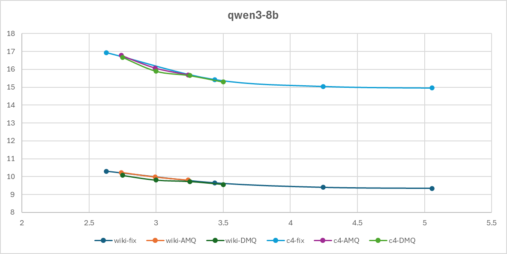
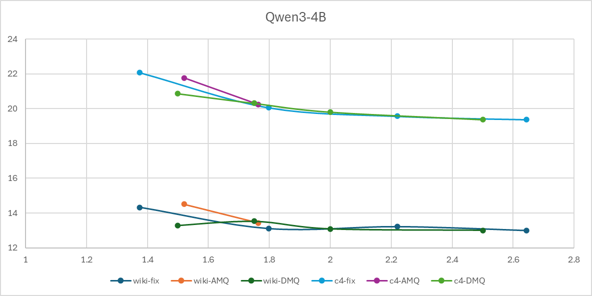
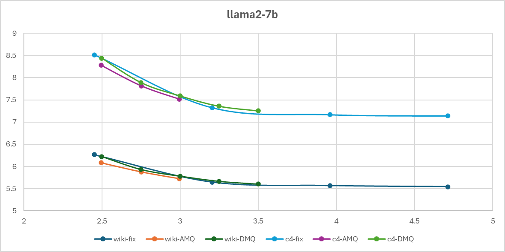
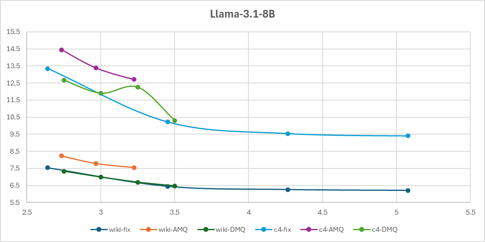
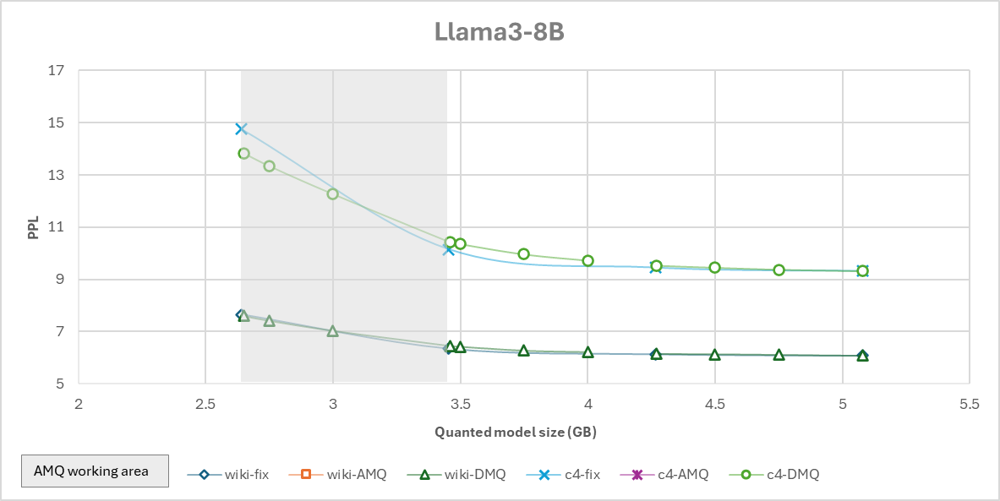
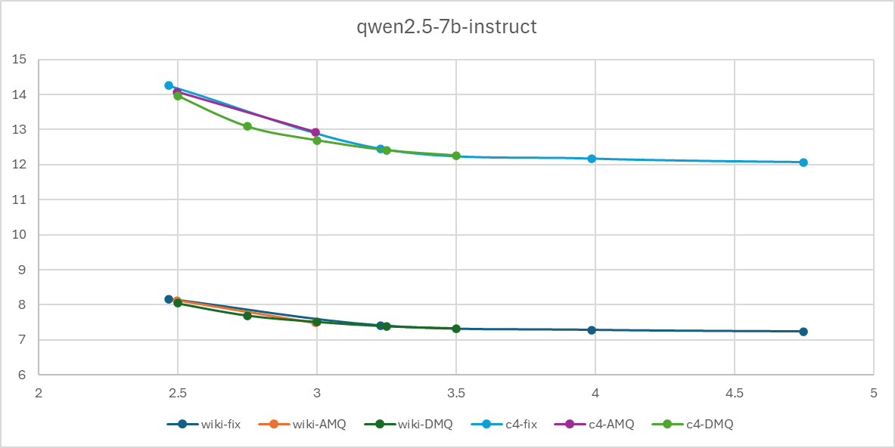

# DartMQ
**DartMQ: Direct Mixed-Precision Quantization for Fixed-Memory-Constrained LLM Deployment**

**DartMQ** is a deterministic, low-overhead framework designed for deploying Large Language Models (LLMs) on resource-constrained embedded systems and consumer-grade GPUs. Unlike traditional quantization methods, DartMQ guarantees that the model fits within a strict, user-defined memory budget while maximizing accuracy.

Our core insight is transforming the precision allocation problem into a **Grouped Knapsack Problem**, solved optimally via **Dynamic Programming (DP)**. This approach eliminates the stochastic search overhead of AutoML methods, reducing search time from hours to minutes.

## Key Features

*   **Hard Memory Constraint Satisfaction:** DartMQ prioritizes "fit-first, optimize-second." It guarantees the quantized model will strictly fit within your GPU/VRAM budget (e.g., 4GB, with command args --vram-quota 4.0 ), avoiding Out-Of-Memory (OOM) crashes.
*   **Global Optimality & Determinism:** By using Dynamic Programming, we find the globally optimal mixed-precision configuration. Unlike genetic algorithms, our results are reproducible and deterministic.
*   **Calibrated Sensitivity:** We correct the bias in traditional Hessian estimation (GPTQ loss) by calibrating local reconstruction errors to actual global Perplexity (PPL) impact. This ensures critical layers (like projection layers) are preserved at higher precision.
*   **Unmatched Speed:** Reduce the mixed-precision search overhead compared to state-of-the-art AutoML methods (e.g., AMQ).
*   **Export to GGUF Format:** Export the mixture precision quantized model to pt
format, then GGUF format with llama.cpp.

## Algorithm Insights
*  **Staircase Effect and Error Compensation** We observe a pronounced staircase effect in local quantization error: increasing the bit-width by a single unit often reduces the local reconstruction error by an order of magnitude. However, this drastic local error reduction only brings marginal improvement in global PPL, as quantization errors in LLMs exhibit complementary robustness across layers, where errors in one layer can be partially absorbed by subsequent layers. This exposes the weakness of greedy strategies, which tend to over-invest memory in layers with large local error drops but negligible global utility. Our grouped knapsack formulation avoids this trap by evaluating the global sensitivity-weighted gain per unit memory for all discrete transitions simultaneously.
*  **Smooth Logarithmic Pareto Frontier** Extensive empirical analysis across mainstream LLM architectures reveals that the memory-accuracy Pareto frontier forms a smooth, continuous, logarithmic-like curve. This smoothness arises from three intrinsic properties: the additivity of quantization loss across layers, the monotonicity between memory savings and bit-width reduction, and the uniform sensitivity distribution of operators in dense Transformer models. This implies that exhaustive heuristic searches of the entire frontier are computationally wasteful; for fixed memory constraints, we only need to pinpoint the single optimal configuration that satisfies the hard budget, motivating our direct solving approach.
*  **Sensitivity Discrepancy Between Local Loss and Global PPL** A fundamental assumption in existing quantization frameworks is that local reconstruction loss serves as a reliable proxy for global performance degradation. However, we reveal a critical input variance bias in this assumption: for projection layers immediately following activation functions (e.g., \texttt{proj\_o} and \texttt{proj\_down}), the input distribution has significantly lower variance due to the squashing effects of activation functions, leading to underestimated Hessian values and artificially low local loss scores. Our controlled experiments show that quantizing these layers causes disproportionate PPL spikes that the local loss fails to predict, which motivates our calibrated sensitivity weighting mechanism.

## Methodology

### 1. The Problem: The Memory-Accuracy Staircase
Uniform quantization (e.g., all 4-bit) creates a "dead zone" of unused memory. For example, a model might fit in 3-bit (low accuracy) or not fit in 4-bit (high accuracy), leaving a gap of unused VRAM capacity.

### 2. The DartMQ Solution
We solve this by assigning varying bit-widths (3, 4, 5, 6 bits) to different operators (layers).

1.  **Pre-Quantization Profiling:** We perform a one-time profiling to each operator to global perplexity impact, correcting the variance-induced bias in Hessian estimation.
2.  **Grouped Knapsack Formulation:**
    *   **Goal:** Minimize total weighted quantization error.
    *   **Constraint:** Total VRAM footprint ≤ User-defined Budget ($V_{max}$).
3.  **Dynamic Programming Solver:** We solve the allocation problem deterministically in milliseconds.

### 3. Sentivity Correction

## Benchmark Results

DartMQ performs near mixed-precision (AMQ) methods under identical memory constraints, but with significantly faster search time.

## vs AMQ 

In terms of accuracy, it can directly achieve precision consistent with AMQ search results. In terms of speed, it is significantly superior to AMQ.


| Process Stage | AMQ Core Functionality | DMQ Core Functionality |
| :--- | :--- | :--- |
| Pre-quantization | **Proxy Quantization:** Uses HQQ to rapidly generate quantized models at different bit-widths to serve as a baseline for subsequent searches. | **Loss Table Calculation:** Utilizes Hessian matrices and activation statistics to directly compute and store an "Operator-Bit-Error" lookup table. |
| Sensitivity Analysis | **Brute-force Probing:** Uses a "leave-one-out" method to calculate JSD distance, exhaustively searching for high-sensitivity operators to forcibly lock (Pass List). | **Topological Correction:** Incorporates "Output/Input Variance Ratio," "Dimension Convergence Ratio," and "Hessian Sensitivity" to automatically identify special operators (like `Down_proj`) without manual locking. |
| Search Strategy | **Pareto Search:** Uses Evolutionary Algorithms (NSGA-II) + Surrogate Models to search for an optimal solution within a vast search space. | **Dynamic Programming:** Based on pre-calculated loss tables, uses a DP algorithm to directly compute the globally optimal bit allocation scheme. |
| Operational Details | Does not support directly capping the memory upper limit via quota (requires manual comparison). Does not support quantization above 5-bit effectively due to the pass list and VRAM limitations. Optimized for specific models. | Fully automated strategy acquisition based on algorithmic calculations. Supports a wider range of models and achieves theoretical minimum loss. |

### Time and Memory Consumption:
* Model: Llama2-7B
* Operating System: Linux (Kernel 5.15.0-122-generic)
* CPU: Intel Xeon Gold 6226R CPU @ 2.90GHz
* GPU: NVIDIA GeForce RTX 3090 (24GB VRAM)
* CUDA Version: 12.8

| Process Stage | AMQ Time | AMQ VRAM | DMQ Time | DMQ VRAM |
| :--- | :--- | :--- | :--- | :--- |
| Pre-quantization | 2bit 77.81s<br>3bit 77.90s<br>4bit 80.02s<br>**Total: 235.73s** | 4.5 GB | 1495.36s | 12.77 GB |
| Sensitivity | 325.33s | 1. Dense Logits: 8.289 GB<br>2. Proxy Model: 11.79 GB<br>Total: 20.18 GB | N/A | N/A |
| Search | 20515.97s | 1. Dense Logits: 8.289 GB<br>2. Proxy Model: 11.79 GB<br>Total: 20.18 GB | N/A | N/A |
| Final Selection | 0.96s | CPU Only | 1.03s | CPU Only |
| Total Summary | **21077.99s** | **Peak: 20.18 GB** | **1496.39s** | **Peak: 12.77 GB** |

Notice: AMQ need more Peak VRAM to support quantization above 5-bit, and the Peak VRAM of DartMQ supports quantization with 3/4/5/6/8-bit. 

### Results:














AMQ: Enabling AutoML for Mixed-precision Weight-Only Quantization of Large Language Models: http://arxiv.org/abs/2509.12019, EMNLP 2025 Oral

## Dependencies

```bash
conda create -n dmq python=3.11
conda activate dmq
conda install pytorch==2.8.0+cu128 torchvision==0.23.0+cu128 torchaudio==2.8.0+cu128 pytorch-cuda=12.8 -c pytorch -c nvidia
pip install datasets==4.4.1
pip install transformers==4.57.5
pip install accelerate==1.12.0
pip install sentencepiece==0.2.0
pip install protobuf==6.33.3
pip install matplotlib==3.10.0
pip install lap==0.5.12
pip install peft==0.14.0
```
Note: please modify the version of some packages for your own environment.

Supported multi GPUs serial execution.
## Supported Models

Dense Models:

Llama-2-7B / Llama3-8B / Llama3.1-8B / Qwen2.5-7B / Qwen3-8B / Qwen3-4B

## Quick Start

Quantize and compress the model to 3GB (when using --not-quant-lm-head, the 3GB does not include lm_head; otherwise, the 3GB includes lm_head).
During the first quantization, a pre-quantized loss.json file needs to be generated in the current directory. For subsequent quantizations, if --recompute-pre-quant is not specified, there's no need to re-pre-quantize; simply use the existing loss.json file. When --recompute-pre-quant is specified, a new loss.json file will be pre-quantized.
```
python run_reconstruct.py $MODEL_PATH wikitext2 --mixqdense --nsamples 64 --vram-quota 3 --not-quant-lm-head --recompute-pre-quant
```
Model evaluation: When using --eval-zero, the quantized model will be evaluated.
```
task_list = ["arc_challenge", "arc_easy", "piqa", "boolq", "winogrande", "sciq", "mnli", "hellaswag", "gsm8k", "mmlu", "triviaqa"]
```

Unified overall quantization method: When using --quant-scheme 2, all operator weights will be quantized to 2-bit.
```
python run_reconstruct.py ~/models/$MODEL_PATH wikitext2 --mixqdense --nsamples 64 --quant-scheme 2 --not-quant-lm-head
```

**Proble quantization: is not nessesary to directly quantize the model, it is an experimental ablation method.**

Layer Probe quantization: When using --profile-only-quant-layers, it will execute extreme 2-bit quantization on the current layer while keeping other layers at 8-bit. When using --profile-only-quant-layers -1, it will execute extreme 8-bit quantization on all layers.
Operator Probe quantization: When using --profile-only-quant-op, it will execute extreme 2-bit quantization on the specified operator across all layers while keeping other layers at 8-bit.
These two commands are typically used separately and usually obtain results through external data statistics. 2-bit and 8-bit configurations need to be modified in the code.
```
python run_reconstruct.py ~/models/$MODEL_PATH wikitext2 --mixqdense --nsamples 64 --profile-only-quant-layers -1
for i in `seq 0 35 `
do
python run_reconstruct.py ~/models/$MODEL_PATH wikitext2 --mixqdense --nsamples 64 --profile-only-quant-layers $i
# sleep 60s
done
```
```
for i in `echo q_proj k_proj v_proj o_proj up_proj down_proj gate_proj `
do
python run_reconstruct.py ~/models/$MODEL_PATH wikitext2 --mixqdense --nsamples 64 --profile-only-quant-op $i
done
```

Model evaluation without Quantization:
```
# python
python eval_cmoe.py $MODEL_PATH 
```

## Code sources

Framework code is referenced from: https://github.com/JarvisPei/CMoE

GPTQ code is referenced from: https://github.com/cat538/MxMoE

Important code is inspired from: https://github.com/xuyuzhuang11/CAMERA

## Cite

If you found this work useful, please consider citing:

```

```